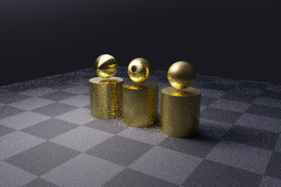
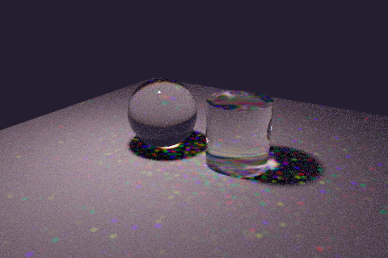

# CYBR LIGHT

Experimental light transport and scene tools, with a native spectral renderer and browser rendering labs.

This public snapshot includes the complete current renderer source and a separately packaged live browser demo under `dist/`. Private development history is preserved in the original repository. See [public release scope](docs/PUBLIC_RELEASE.md) for the exact restored assets, licensing, delivery adapter and remaining exclusions.

To run the packaged demo, serve `dist/` with `python -m http.server 4181 --bind 127.0.0.1 --directory dist`, then open `http://127.0.0.1:4181/`. The native build commands below still apply at the repository root.

A source ZIP or source-only hosting checkout can first run `python tools/restore_live_assets.py` to retrieve the exact cleared runtime files from the pinned public asset commit. Full GitHub clones already include those files.

| Backend | What it renders | Entry point |
| --- | --- | --- |
| Native C++17 + Python | Offline wavelength-dependent light transport, materials, media and diagnostic films | `python tools/examples.py anisotropy --preset smoke` |
| Optional CUDA/OptiX | Spectral surface transport on supported NVIDIA hardware; restricted feature subset | [OptiX guide](docs/OPTIX.md) |
| Browser WebGPU | RGB path tracing with BVHs, optical transport and temporal/spatial reconstruction | `/browser/` |
| Browser forest prototype | Indexed raster geometry, cached sunlight shadows and approximate sky lighting | `/browser/forest-game.html` |
| Browser hybrid lab | Experimental raster visibility and ray-based lighting/reconstruction modes | `/browser/hybrid-lab.html` |

The browser backends do not provide native spectral parity. The forest prototype uses rasterization and cached lighting. Existing rendering defects and historical measurements are documented in [known issues](docs/KNOWN_ISSUES.md).

## Rendered examples

| Anisotropic metals | Spectral caustics | Nested glass |
| --- | --- | --- |
|  |  |  |

These are actual previously rendered native previews, not fresh consolidation benchmarks. [Render records](docs/media/index.json) retain their settings and hashes. Reproduce an example with the commands below.

## Native quick start

Requirements: CMake 3.16+, a C++17 compiler, Python 3.10+, NumPy and Pillow. OpenMP is optional. NumPy/Pillow are installed by the package; optional tensor, Numba and EXR-reader dependencies are separate.

```bash
python -m venv .venv
# Linux/macOS: source .venv/bin/activate
# Windows PowerShell: ./.venv/Scripts/Activate.ps1
python -m pip install -e .
cmake -S . -B build
cmake --build build --config Release --parallel 2
python tools/examples.py anisotropy --preset smoke --threads 2
```

Open `rendered/examples/anisotropy.png`. On a single-configuration generator, pass `-DCMAKE_BUILD_TYPE=Release` when configuring. Windows MSVC builds use the Release executable; GCC/Clang builds retain their existing optimization flags. Native material JIT compilation currently requires a GCC/Clang-style `c++` toolchain, including on platforms where the basic renderer builds with MSVC.

Set `CYBR_LIGHT_BINARY` or pass `--executable` to the CLI when the executable is installed elsewhere.

```bash
python tools/examples.py --list
python tools/examples.py dielectrics cloud --preset smoke --threads 2
python -m cybrlight features
python -m cybrlight validate examples/workflow/instances.xml
```

`smoke` uses 160×106, four wavelength packets per pixel and four wavelengths per packet. `preview` uses 480×320, 64 packets and eight wavelengths; `reference` uses 720×480, 192 packets and twelve wavelengths. Photon budgets vary by preset. A preset is a sampling budget, not a convergence guarantee.

## Python scene API

```python
from cybrlight import Camera, Scene, Settings, render

scene = Scene("Spectral glass")
scene.settings = Settings(
    width=640, height=424, spp=96, bands=12, threads=4,
    film_format="openexr",
)
scene.camera = Camera(origin=(4, 2.5, 6), target=(0, 0.7, 0), fov=38)
floor = scene.material(type="diffuse", color=0.6)
glass = scene.material(type="glass", ior_a=1.5, ior_b=0.008,
                       absorption=(0.25, 0.04, 0.01))
scene.quad((-5, 0, -5), (0, 0, 10), (10, 0, 0), floor)
scene.sphere((0, 0.8, 0), 0.8, glass)
scene.point_light((-2, 4, 3), 45)
scene.environment.update(color=[0.5, 0.65, 0.85], strength=0.15, flat=True)
render(scene, "rendered/custom/glass")
```

Three-component material values are spectral authoring controls. See [spectral data notes](data/README.md), [architecture](docs/ARCHITECTURE.md), [capability matrix](docs/CAPABILITY_MATRIX.md), and [example workflows](examples/README.md).

Native output includes linear PFM, PNG display previews and optional float32 EXR. Checkpoint/resume validates scene and asset signatures. Native compiled shader libraries execute code; use trusted scene bundles.

## Browser quick start

Serve the packaged browser runtime:

```bash
python -m http.server 4181 --bind 127.0.0.1 --directory dist
```

Open `http://127.0.0.1:4181/browser/?scene=proof-optics&resolution=540&bounces=6` in a browser with WebGPU support. On Windows, `./tools/Start-BrowserPreview.ps1` starts a dedicated Chrome/Edge profile; its footer must confirm the selected adapter.

The URL above runs a built-in procedural scene without external assets. `proof-metals` and `proof-indirect` also run from source. The packaged runtime defaults to the optics proof. Original source entrypoints remain under `browser/` for inspection.

The public repository retains the cleared gallery, six-module instrument, cached FLIP and complete forest runtime under `dist/`. Source-only ZIPs and Site checkouts can run `python tools/restore_live_assets.py` to retrieve all 336 verified files from the pinned public commit. Availability, licenses and the remaining excluded Observatory/Geode scene families are documented in [asset preparation](docs/ASSETS.md) and [public release scope](docs/PUBLIC_RELEASE.md). The [publication inventory](docs/PUBLICATION_INVENTORY.json) records the earlier source-only capture separately. Cached FLIP frames are recorded geometry, not a live fluid simulation.

For the four native-authored material/knot browser studies, run `python tools/prepare_browser_examples.py` after installing the package. This regenerates geometry with verified hashes and retains the included original material manifests.

Qualcomm/Adreno adapters select the workgroup-memory medium candidate only after device storage and workgroup limits pass. It retains all sixteen glass/water slots and exact boundary keys. `mediumStack=scalar` restores the version-10 scalar form; `mediumStack=legacy` restores the original form. Other adapters keep the original form unless explicitly selected. NVIDIA compilation, two-stack state comparisons and six-/ten-bounce pixel parity pass; phone startup failure was reported after version 11 publication. The ordinary error panel now records the failing stage and selected medium mode locally; physical Adreno success remains unverified. See [mobile GPU recovery](docs/MOBILE_GPU_RECOVERY.md).

See [browser modes and controls](browser/README.md), [diagnostics](browser/DIAGNOSTICS.md), and [gallery rebuilding](browser/GALLERY.md).

## Validation

```bash
ctest --test-dir build --build-config Release --output-on-failure
python -m unittest discover -s tests -p 'test_*.py' -v
node --test browser/*.test.mjs
python tools/check_repository.py
python tools/check_publication.py
node tools/check_proof_scenes.mjs
```

The Python suite includes actual native scene/film, checkpoint, XML/bundle and README-render workflows. The Node suite checks CPU geometry, contracts and shader construction. GPU appearance and interaction still require actual browser runs with matched settings and inspected pixels. Optional JIT tests need the toolchain noted above; optional GPU backends need separate hardware validation.

## Source layout

`include/cybr/` and `src/` contain native transport; `python/cybrlight/` contains authoring, I/O and optional backend adapters. `browser/` contains the WebGPU renderer, hybrid lab and forest prototype. `tests/` and adjacent browser tests retain current regressions; `docs/` contains current guides, real previews and provenance. Generated scene binaries, caches, local previews and validation outputs are excluded from Git/tooling scope.

Historical iteration reports, rejected prototypes and obsolete probes remain in the private recovery checkpoints. Their removal from the working tree is organizational cleanup, not a measured rendering optimization.

## License and provenance

The existing [GPLv2 license](LICENSE), [original engine MIT notice](LICENSES/CYBR_LIGHT_ORIGINAL_MIT.txt), and meshoptimizer notices in `browser/vendor/meshoptimizer-1.3.0/` are retained. Optional SDKs and dependencies have their own licenses. [Historical native provenance](docs/NATIVE_PROVENANCE.json) records the earlier import; [current source baseline](docs/SOURCE_BASELINE.json) records the preserved renderer implementation for this consolidation.
