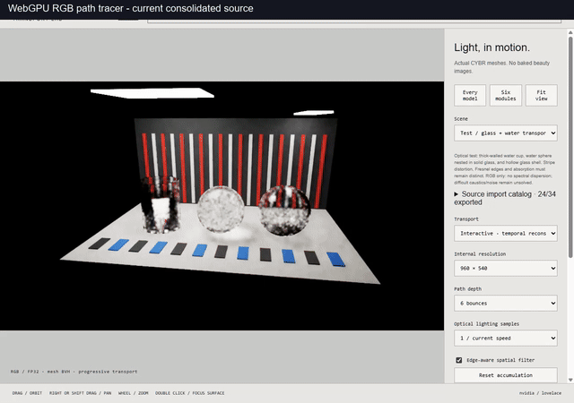

# Consolidation validation, 2026-10-07

The tables below record the original cleanup acceptance checks. Later public runtime restoration and live delivery are described in [asset closure](ASSETS.md) and [public release scope](PUBLIC_RELEASE.md); the historical source-only omission counts do not describe the current packaged demo.

This publication contains the current local native spectral renderer, optional CUDA/OptiX backend, browser RGB path tracer and forest raster prototype. The baseline is the preserved current local implementation, not the older remote `master` implementation. Native transport and production WGSL were preserved during cleanup; `SOURCE_BASELINE.json` records 64 implementation digests.

The isolated publication branch starts at remote `master` commit `38f29ee2f6559311513c1f570be7a36224194ce8`. All current remote files are accounted for; three superseded baseline/restoration documents were removed. Unrelated open scene PRs were not merged. The private source captures and recovery data were retained separately.

## CPU and source checks

| Check | Result |
| --- | --- |
| Fresh MSVC native build | All four targets built |
| CTest | 2/2 suites; 75 numerical/engine checks passed |
| Browser CPU tests | 263 passed, zero failed or skipped |
| Python/native workflow suite | 81 retained tests: 73 passed, 8 existing JIT-toolchain errors |
| Current renderer digest/entrypoint/license checks | 64 implementation digests passed |
| Actual native anisotropy, dielectrics and cloud workflows | Baseline/staged PFM and PNG pixels exactly equal; finite output and EXR export checked |
| Localhost source/asset delivery | 16 checks passed |

Those native/GPU/HTTP comparisons used the full 652-file local runtime tree, including companion assets. They do not establish that omitted scenes run from the smaller publication tree. Publication was separately checked from an export of only staged files: native build/workflows, all 263 browser CPU tests, recursive source imports and the production worker's three built-in proof scenes with external fetches forbidden. See [asset closure and omissions](ASSETS.md).

Four native-authored browser geometry exports and the generated native knot OBJ matched the captured bytes exactly. Their four original small material manifests are included; a preparation helper verifies decompressed geometry before restoring those manifests, including conductor annotations omitted by the original exporter. These CPU reproduction checks do not certify imported/forest assets or additional browser appearance modes.

The first restricted-sandbox CMake configure could not discover MSVC and left empty compiler flags in its cache. That build's engine test terminated at its exception/checkpoint checks. A fully fresh configure outside that sandbox restored normal compiler flags, but the earlier interrupted test had left its fixed checkpoint filename in the shared temporary directory. The existing Windows checkpoint rename cannot replace that destination, so the fresh test also terminated. Without changing renderer/test source or deleting shared files, the same fresh source-only build passed both CTest suites using a new workspace-local TEMP directory. This repeatability/Windows checkpoint issue remains documented in known issues; the failures are not hidden.

Native comparison settings: 160x106, four packets per pixel, four wavelengths per packet, seed 12345, two CPU threads. Actual small native renders and README-render workflows were executed; numerical unit tests alone were not treated as appearance validation.

The eight Python errors match the preserved baseline. This Windows environment has MSVC but no GCC/Clang-style `c++` compiler for the existing material JIT commands. No tests were dropped or changed to hide these failures:

- `GraphStorageTests.test_roundtrip_eager_compiled_and_gradient`
- `CompilerTests.test_compiled_broadcast`
- `CompilerTests.test_compiled_matches_eager`
- `CompilerTests.test_native_shader_abi`
- `CompilerTests.test_source_is_independent`
- `DeliveryRobustnessTests.test_constant_kernel_explicit_error`
- `HigherDerivativeTests.test_second_derivative_compiles_and_matches_analytic`
- `HigherDerivativeTests.test_stable_extreme_sigmoid`

Five rejected-experiment-only browser test files were removed together with their unused prototype source from the working tree; the preserved current-source baseline and publication both run the same 263 checks. Active experimental-signals shader files and current production tests were retained.

## Actual browser/WebGPU comparison

Sequential baseline and staged runs used the same NVIDIA RTX 4060 Laptop/Lovelace adapter, Chrome process, 1280x900 viewport, 960x540 internal rendering and byte-identical original assets. Eight inspected image comparisons had zero pixel error: stationary/moving main tracer, 64-step raw reference, 32-step imported GEO wrist and optical LIGHT module, and forest trail/canopy/clearing views.

Real controls exercised transport/reference mode, reset, 540/360 resolution, spatial filter, Fit view, mouse orbit, imported scene selection and forest view/LOD selection. Both versions reported zero renderer errors and zero failed renderer/asset requests. The first harness label-selector timeout and a one-frame UI sampling mismatch were corrected in the harness; exact paused/reset captures resolved the sampling ambiguity without source changes.

| Pipeline/view | Baseline GPU ms | Staged GPU ms | Baseline/staged presented FPS |
| --- | ---: | ---: | --- |
| Main tracer, stationary | 7.125 | 7.287 | Manual 64-step submissions |
| Main tracer, moving | 8.196 | 8.100 | Manual 32-step submissions |
| Forest trail | 12.858 | 13.370 | 76.96 / 73.53 |
| Forest canopy | 4.458 | 4.603 | 121.03 / 125.38 |
| Forest clearing | 15.567 | 16.202 | 63.92 / 61.41 |

Main settings: six bounces, one optical sample, normal single-coverage reconstruction and spatial filter. Forest settings: 0.75-pixel detail error, 4x MSAA, 1,220,375 source instances; 180 observed frames per view. GPU timestamps were measured, not inferred from source hashes. These short windows differ by approximately -1.2% to +4.1%; OS/browser pacing and thermal state can vary. They do not establish statistical performance equivalence or a universal FPS guarantee.

All owned browser contexts, Chrome and the read-only test server were closed after validation. NVIDIA reported 0% utilization and 0 MiB after closure. Optional native CUDA/OptiX execution, all-gallery/FLIP combinations and separate/hybrid browser frontends were not tested in this hardware pass.

## Actual preview

This is a downscaled presentation of actual staged-only browser video. The first segment is the RGB path tracer; the second is raster geometry with cached sunlight shadows and approximate sky lighting. GIF playback rate does not measure renderer performance. No image generation, frame interpolation or additional denoising was applied to the recorded footage. The tracer's existing temporal/spatial reconstruction remains enabled. [Capture provenance](pr-assets/PROVENANCE.json) records settings, source and image hashes.

Existing moving glass/edge noise, approximate forest lighting/LOD and the clearing camera's branch intersection remain. See [known issues](KNOWN_ISSUES.md). Large asset packs are preserved locally but excluded from source publication; see [asset reproduction](ASSETS.md).

The forest/imported-scene preview demonstrates the validated local runtime. Its companion scene files are not distributed by this source branch; a fresh clone cannot reproduce those segments yet. The procedural main-tracer segment has its source present. Full runtime closure is a remaining publication blocker, not an accepted renderer fix.

## Publication scope

Source byte contracts retain the original captured line endings; `.gitattributes` prevents implicit checkout normalization. This keeps the implementation digests and recorded capture source reproducible across platforms.

The existing GPLv2 license, original native MIT notice and meshoptimizer MIT notices remain intact. The curated branch contains no credentials or private recovery archives. Its source audit does not clear older repository history, other branches/PRs, media or retained Actions artifacts for a repository visibility change. Visibility review and any final merge remain separate steps. No deployment or release is included.
