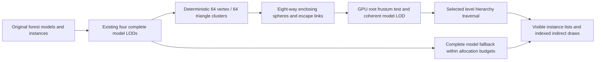

# Experimental resident forest meshlets

Baseline rendering remains the default. The measured grouped experiment is `/browser/forest-game.html?meshlets=1&meshletGroup=8`. Fine clusters at `?meshlets=1` remain unsupported experimental research: their equivalent real-forest sweep is unverified. Neither experiment demonstrated a speedup over baseline on the tested desktop. This is a resident meshlet culling and hierarchical bounds/LOD stage; streaming is not implemented, and no Nanite parity is claimed.

## Architecture and preservation



The JavaScript builder sorts triangle centroids by Morton code, with leaf-mask and original-ordinal ties. It preserves exact vertex words, oriented triangle multiplicity, materials, instance transforms and leaf masks. It follows [meshoptimizer cluster concepts](https://github.com/zeux/meshoptimizer#clusterization), rather than calling its clusterizer or claiming its partition quality. The bundled meshoptimizer simplifier still generates the existing LODs. Unlike [clustered simplification](https://github.com/zeux/meshoptimizer/blob/master/extra/clusterlod.h), this stage selects a complete model level rather than independently simplified cluster cuts.

Float32 spheres are inflated conservatively. Each instance selects one of four complete levels using cumulative maximum simplifier error, scale and nearest root-sphere depth. The projection uses the existing 540-pixel raster height. Production selection requires 90% of the pixel threshold to demote and the original threshold to promote. Clusters within an instance never use mixed levels. `Full geometry` selects level zero and retains the exact source triangle set; this does not disable safe offscreen culling. Unadmitted models retain complete original LOD draws.

Portable WebGPU compute traverses preorder hierarchy nodes and escape links. Visible leaves append instance IDs to draw lists sized for every instance of their model. There is one dispatch of 9,535 workgroups, workgroup size 128, six storage bindings and ordinary vertex/fragment rendering. Indirect `firstInstance` remains zero; see the [GPUWeb indirect command definition](https://github.com/gpuweb/gpuweb/blob/main/spec/index.bs). Mesh shaders, occlusion and cone culling are absent. Cached sunlight continues to draw complete level-zero meshes. Path-tracing BLAS/TLAS, transport, native rendering and the separate Adreno shader issue are unchanged; 72 protected hashes are retained.

Admission is deterministic and bounded by 8,192 draws, 64 MiB of draw lists and 16 MiB of node storage. Coarse mode groups up to eight adjacent fine meshlets into an enclosing draw and hierarchy leaf. It retains the same 11 admitted models and 453 fallbacks so freed capacity does not confound the comparison.

| Allocation | Baseline | Fine | Grouped |
| --- | ---: | ---: | ---: |
| Indirect commands | 1,856 | 8,189 | 2,630 |
| Hierarchy nodes | — | 9,150 | 2,776 |
| Draw-list bytes | 19,526,000 | 35,141,712 | 21,439,392 |
| Node bytes | — | 292,800 | 88,832 |
| Resident vertex/index bytes | 465,192,680 | 465,192,680 | 465,192,680 |

## Measured result and visual limits

[Matched results](MESHLET_RASTER_GPU_MATCHED.json) evaluate commit `6eebab0` on Chrome 145.0.7632.160 / NVIDIA Lovelace, at identical cameras, 960x540 raster, four-sample MSAA and 0.75-pixel detail. Timing counters were off; dedicated current-cull diagnostics were collected separately. Validation-only shaders and CPU oracle disable hysteresis in all paths and use cumulative error maxima. The original forest errors were monotonic, so the error clamp changed no values. Production files were not altered by this control.

| View / mode | GPU mean / p95 ms | Frame CPU mean / p95 ms | Submitted triangles |
| --- | ---: | ---: | ---: |
| Trail baseline | 12.977 / 13.238 | 0.203 / 0.300 | 37,653,609 |
| Trail fine | 13.264 / 13.631 | 0.350 / 0.400 | 37,096,268 |
| Trail grouped | 13.154 / 13.435 | 0.292 / 0.300 | 37,310,714 |
| Under crowns baseline | 1.700 / 1.704 | 0.148 / 0.200 | 5,756,230 |
| Under crowns fine | 1.881 / 1.901 | 0.197 / 0.400 | 5,173,419 |
| Under crowns grouped | 1.709 / 1.769 | 0.145 / 0.300 | 5,278,775 |

Grouping lowers fine-mode overhead, but GPU means remain 1.36% slower than baseline in Trail and 0.58% slower under crowns. Grouped triangle savings are 0.91% and 8.29%. Startup was 19.497 / 26.123 / 28.401 seconds for baseline / fine / grouped; worker time was 15.452 / 21.263 / 22.543 seconds. Added preprocessing and resident allocations remain costs. These are sequential, short samples from one desktop, without separate compute/render timestamps or confidence intervals; near-neutral results are not a demonstrated speedup. Frame CPU timing surrounds submitted animation callbacks and excludes asynchronous GPU completion; its timer resolution is coarse for these small values.

Four grouped GPU/CPU visible-list cases passed with zero overflow. Corrected dedicated-cull counters report 245,686 visible root instances in Trail and 509 under crowns, with zero overflow. Diagnostics drain prior work, write current settings, dispatch and read back in queue order, preventing stale counters from being labeled as current.

All six saved matched 0.75-pixel images are pixel-identical (1,008,640 pixels per view). CPU inspection shows no missing geometry in [Trail](pr-assets/meshlet-trail-lod.png) or [Under crowns](pr-assets/meshlet-under-crowns-lod.png). Earlier production full-detail pairs were identical under crowns and differed at 20 Trail pixels, maximum 6/255 channel difference; [historical evidence](MESHLET_RASTER_GPU_STAGE1.json) retains its different-hysteresis confounder.

The later [grouped acceptance ledger](MESHLET_RASTER_GROUPED_ACCEPTANCE.json) reconciles 17 valid stored-depth prefix captures with 62 passing v3 continuation captures: 79 unique poses, all five authored views and 167 transformed triangle probes. Production 90% demotion hysteresis is retained. Each normal render is compared against all clusters of the same complete selected model LOD with the same root cull, materials and transforms. All decoded color pairs are identical; all recorded four-sample depth/count/history checks pass. Fifteen identical-camera/detail holds have zero image or LOD change. Full-detail captures cover Trail, Canopy, Under crowns and Clearing; the approximately 1.89-billion-triangle Whole-stand full-detail view is excluded by the 600M budget. This run is geometry validation, not a new timing measurement.

[Ordered visual review](MESHLET_RASTER_VISUAL_REVIEW.md) records an important limit: Under-crowns cases 38..43 are nearly black in both normal and reference, and Clearing has substantial shared foreground occlusion. Their cause is not confirmed by the stored images/counts. These frames are retained rather than omitted. Recorded pans and threshold brackets do not certify every intermediate frame, arbitrary-camera behavior or unobtrusive LOD transitions. Coherent selection prevents mixed-level seams within an instance, but complete levels still switch discretely; there is no geomorph or transition blend. Simplifier error estimates are not a perceptual guarantee. Baseline therefore stays default.

## Reproduction

Run from the repository root:

```sh
node --test browser/meshlet-hierarchy.test.mjs browser/forest-diagnostics.test.mjs browser/forest-detail.test.mjs
node tools/measure_forest_meshlets.mjs <original-forest-assets> output/meshlet-fine.json 1
node tools/measure_forest_meshlets.mjs <original-forest-assets> output/meshlet-grouped.json 8
python tools/record_meshlet_provenance.py <checkout-at-8f82e06>
```

Where child test spawning is unavailable, run `node -e "const fs=require('fs');Promise.all(fs.readdirSync('browser').filter(x=>x.endsWith('.test.mjs')).map(x=>import('./browser/'+x)));"`. All 339 browser CPU tests pass. The Naga 30.0.1 validator in `tools/wgsl-validator` validates the new compute shader, both original raster shaders and the isolated acceptance shaders with all validation flags and no optional capabilities. CPU tests cover exact geometry, deterministic grouping/budgets, enclosing spheres, clipping equivalence under seeded transforms, LOD threshold/hysteresis, diagnostic queue ordering, injected depth holes/all-clear evidence, stale history and strict fallback-count failures. Generated fine and grouped hashes are recorded in the CPU reports; fine builds repeated identically.

[Acceptance commands and preserved failures](MESHLET_RASTER_ACCEPTANCE.md) document the separate grouped campaign and CPU reconciliation. The [fallback proof](MESHLET_RASTER_FALLBACK_PROOF.json) and [binary32 proof](MESHLET_RASTER_FLOAT32_PROOF.json) diagnose the failed count oracles without changing production renderer source. Those historical native receipts remain failed or invalid in the ledger; the successful v3 continuation is a separate receipt.

To prepare the matched policy without starting a server or GPU, run `python tools/meshlet_validation_server.py --matched-lod --export-policy`. For a separately authorized serialized native comparison, start the same command without `--export-policy`, pass `--assets <original-forest-assets>` if needed, then execute `tools/meshlet-benchmark.browser.js` with an existing safe Playwright harness. Its default port is 8037 and screenshot folder is `output/meshlet-benchmark`; create that folder first. The harness checks equivalence, visits baseline/fine/grouped, waits four seconds per view and saves current timing/draw/counter evidence. Use a fresh isolated native profile with sandboxing and pre-spawn argument allowlisting, a three-minute outer bound, and close the owned browser/server afterward. The recorded run released all resources after 106 seconds; this documentation finalization used no GPU or browser.

## Streaming boundary and review

Geometry is fully resident. There is no page fetch, residency table, compression, eviction, virtual geometry or dynamic cluster simplification. Existing model/level roots and draw ranges provide an eventual page boundary. A future residency mechanism must retain a complete fallback until every page of the selected cut is available; partial arrivals must never remove geometry. That stage is deferred.

This source-only draft is stacked on PR #1's public `8f82e06` branch to isolate the raster diff. Parent owns review, retargeting, merge and any `dist`/Site packaging. No deployment is included.
